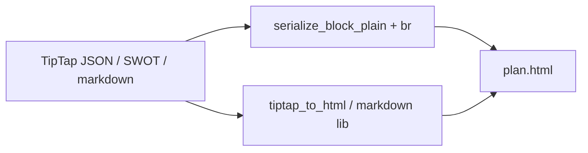
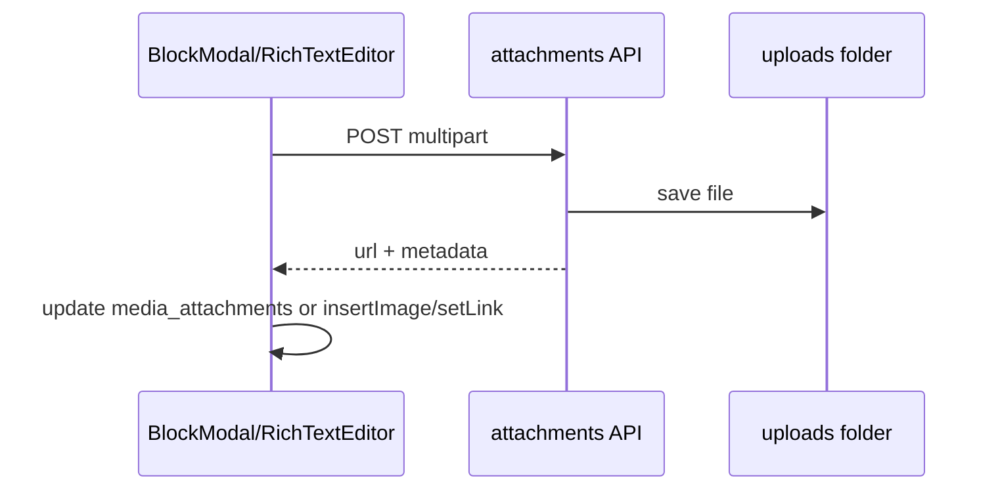

# План: экспорт HTML, редактор TipTap, шаблоны RU

## Отчёт о уже выполненной работе

### Frontend (предыдущий этап)

| Область | Что сделано |
|---------|-------------|
| SWOT | [`blockDefaults.ts`](frontend/src/lib/blockDefaults.ts): дефолты, `normalizeSwotData`, сброс `rich_content` при смене типа; исправлен `isRichBlock` в [`BlockModal.tsx`](frontend/src/components/BlockModal.tsx) |
| Markdown | [`MarkdownPreview.tsx`](frontend/src/components/MarkdownPreview.tsx) + GFM; preview в редакторе и в [`BlockRenderer.tsx`](frontend/src/components/BlockRenderer.tsx); стили `.markdown-body` в [`index.css`](frontend/src/index.css) |
| TipTap | Синхронизация контента при edit; таблицы 3×3, add/delete row; русский тулбар в [`ru.ts`](frontend/src/i18n/ru.ts) |
| i18n | Центральный [`ru.ts`](frontend/src/i18n/ru.ts); русификация модалок, блоков, toast на страницах планов |
| Прочее | `chart_embed` без фин. планов — подсказка; `lang="ru"` в [`index.html`](frontend/index.html) |

### Backend (предыдущий этап)

| Область | Что сделано |
|---------|-------------|
| Сериализация | [`block_serializer.py`](backend/fastapi_application/api/api_v1/business/business_plan/block_serializer.py): SWOT, markdown, timeline, metrics, checklist в export/import |
| Import | Сохранение `block_type` умных блоков; `build_import_rich_content` вместо принудительного `general` |
| Export | Плоский текст + `html.escape` для блоков; **форматирование TipTap в HTML пока не рендерится** (корень текущей проблемы) |
| Snapshots | Restore с `linked_financial_chart_ids` |
| CRUD | `block_order = max + 1` при создании блока в [`plan_block/crud.py`](backend/fastapi_application/api/api_v1/business/plan_block/crud.py) |
| Ошибки | `HTTPException` не превращается в 500 в [`main.py`](backend/fastapi_application/main.py); русские `detail` в API |

---

## Диагностика текущих проблем

### 1. HTML-экспорт

В [`views.py`](backend/fastapi_application/api/api_v1/business/business_plan/views.py) export вызывает `serialize_block_html`, который делает только **plain text + `<br>`** ([`block_serializer.py`](backend/fastapi_application/api/api_v1/business/business_plan/block_serializer.py) L107–109). Теряются: жирный/курсив, списки, таблицы, код, SWOT-структура в виде секций.

Дополнительно: `{plan.title}` и `{plan.description}` в шаблоне HTML **не экранируются** (риск поломки файла и XSS).

Markdown-блоки экспортируются как сырой текст, а не как HTML.



### 2. Списки в редакторе

В [`index.css`](frontend/src/index.css) есть стили для `.markdown-body ul/ol`, но **нет** для `.tiptap ul` / `.tiptap ol`. Из-за Tailwind reset оба списка визуально выглядят как маркированные (кружки), нумерация не видна.

### 3. Код, подстрочный текст

- Кнопка «Код» вызывает `toggleCode` — **inline** `<code>`, а не блок `codeBlock`; нет отдельной кнопки для блока кода.
- Subscript не подключён (вы выбрали именно его).

### 4. Таблицы

- `addRow` и `deleteRow` используют одинаковую иконку `Rows3` ([`RichTextEditor.tsx`](frontend/src/components/RichTextEditor.tsx) L92–93).
- Нет `addColumnBefore/After`, `deleteColumn`.

### 5. Шаблоны

Сид в [`cedb05384afc_seed_default_templates.py`](backend/fastapi_application/alembic/versions/2026_05_18_2321-cedb05384afc_seed_default_templates.py) — полностью на английском. UI уже на русском, но при создании плана из шаблона блоки остаются EN.

### 6. Файлы

Поле `media_attachments` есть в модели [`plan_block.py`](backend/fastapi_application/core/models/plan_block.py), но **нет API загрузки** и UI. Inline-вложения в TipTap не реализованы.

---

## Фаза A — HTML-экспорт (backend)

**Файл:** [`block_serializer.py`](backend/fastapi_application/api/api_v1/business/business_plan/block_serializer.py)

1. Добавить рекурсивный `tiptap_json_to_html(node)` для типов:
   - `doc`, `paragraph`, `heading` (h1–h3)
   - `bulletList`, `orderedList`, `listItem`
   - `text` + marks: `bold`, `italic`, `strike`, `highlight`, `code`, `subscript`, `link`
   - `codeBlock`, `blockquote`, `hardBreak`
   - `table`, `tableRow`, `tableHeader`, `tableCell`
2. `serialize_block_html` для rich-блоков → `tiptap_json_to_html(rich_content)` вместо plain+br.
3. Для `markdown` — конвертация через Python `markdown` + `tables` extension (добавить в requirements).
4. Для SWOT — HTML-секции с `<h4>` и `<ul>` (уже есть логика в plain, перенести в HTML).
5. В [`views.py`](backend/fastapi_application/api/api_v1/business/business_plan/views.py):
   - экранировать `plan.title`, `plan.description`, даты;
   - встроить CSS для `ul/ol`, `table`, `pre/code`, `mark`, `sub` в `<style>` экспортируемого файла;
   - русские подписи метаданных («Создан», типы блоков).

---

## Фаза B — Русские шаблоны (backend)

**Новая Alembic-миграция** (не править старый seed): `UPDATE templates SET title, description, blocks = ...` для 5 шаблонов.

Содержимое:
- Русские `title` / `description` / названия блоков
- Для SWOT-блоков: `rich_content` с пустыми квадрантами `{ strengths: [""], ... }` (как в [`blockDefaults.ts`](frontend/src/lib/blockDefaults.ts))
- TipTap `rich_content` для general-блоков с русским текстом-заглушкой

После миграции: `alembic upgrade head` на окружении с уже применённым старым seed.

---

## Фаза C — TipTap: списки, код, подстрочный, форматирование, высота

**Файл:** [`RichTextEditor.tsx`](frontend/src/components/RichTextEditor.tsx) + [`index.css`](frontend/src/index.css) + [`ru.ts`](frontend/src/i18n/ru.ts)

### CSS (списки и высота)

```css
.tiptap { min-height: 220px; }
.tiptap ul { list-style: disc; padding-left: 1.5rem; }
.tiptap ol { list-style: decimal; padding-left: 1.5rem; }
.tiptap code { ... }
.tiptap pre { ... }
.tiptap sub { font-size: 0.75em; }
.tiptap mark { background: ...; }
```

### Расширения TipTap (npm, версия 3.23.4)

| Функция | Пакет |
|---------|--------|
| Зачёркивание | `@tiptap/extension-strike` (или из StarterKit) |
| Маркер | `@tiptap/extension-highlight` |
| Подстрочный | `@tiptap/extension-subscript` |
| Блок кода | `codeBlock` из StarterKit + кнопка `toggleCodeBlock` |
| Inline-код | оставить `toggleCode` отдельной кнопкой |
| Ссылка на файл/картинка inline | `@tiptap/extension-image` + custom file link node или Link + upload |

### StarterKit

Пересмотреть конфиг: не дублировать list-расширения конфликтно; при необходимости оставить lists **только** через StarterKit (убрать отдельные BulletList/OrderedList), чтобы listItem корректно связывался.

### Тулбар

| Кнопка | Действие | Иконка |
|--------|----------|--------|
| Зачёркнуть | `toggleStrike` | `Strikethrough` |
| Маркер | `toggleHighlight` | `Highlighter` |
| Подстрочный | `toggleSubscript` | `Subscript` |
| Блок кода | `toggleCodeBlock` | `FileCode` |
| Inline-код | `toggleCode` | `Code` |
| +строка | `addRowAfter` | `Rows3` |
| −строка | `deleteRow` | `Trash2` или `RowMinus` |
| +столбец | `addColumnAfter` | `Columns3` |
| −столбец | `deleteColumn` | `ColumnMinus` / `Trash2` |

---

## Фаза D — Файлы (backend + frontend)

### D1. Вложения к блоку (`media_attachments`)

**Backend:**
- `POST /api/v1/business/plans/{plan_id}/blocks/{block_id}/attachments` — `UploadFile`
- Хранение: `uploads/plans/{plan_id}/{uuid}_{filename}` (папка в `.gitignore`)
- Запись в `media_attachments`: `{ id, name, url, size, mime_type }`
- `DELETE .../attachments/{attachment_id}`
- Лимит размера (напр. 10 MB) и whitelist MIME

**Frontend:**
- Секция «Файлы» в [`BlockModal.tsx`](frontend/src/components/BlockModal.tsx) для rich-блоков
- Список + кнопка загрузить + удалить
- Строки в [`ru.ts`](frontend/src/i18n/ru.ts)

### D2. Inline в редакторе

- `@tiptap/extension-image` для изображений (upload → URL → `setImage`)
- Для прочих файлов: вставка ссылки `<a href="...">имя файла</a>` после upload
- Кнопка «Вставить файл» в тулбаре TipTap



---

## Фаза E — Проверка

1. HTML: план с bold, списками, таблицей, SWOT, markdown → открыть `.html` в браузере — форматирование на месте.
2. Шаблон «SaaS» → русские названия блоков, SWOT редактируется.
3. Маркированный и нумерованный списки визуально различаются.
4. Subscript, strike, highlight, code / codeBlock работают и сохраняются.
5. Таблица: разные иконки row/col; add/delete column работает.
6. Редактор: `min-height` ~220px при открытии.
7. Файл к блоку + картинка inline в тексте.

---

## Зависимости

**Frontend (npm):**
- `@tiptap/extension-strike`
- `@tiptap/extension-highlight`
- `@tiptap/extension-subscript`
- `@tiptap/extension-image`
- `@tiptap/extension-link` (если ещё нет)

**Backend (pip):**
- `markdown` (для export markdown-блоков)

---

## Порядок реализации

1. CSS списков + min-height + code (быстрый win)
2. TipTap extensions + тулбар + иконки таблицы
3. HTML export (`tiptap_json_to_html`)
4. Миграция русских шаблонов
5. API и UI файлов (block + inline)
